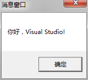
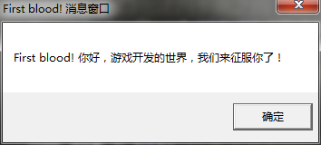

# Windows编程入门
- HelloVisualStudio这个项目介绍了，Windows程序的“心脏”——WinMain函数，以及MessageBox函数的详细用法。
- FirstBlood!这个项目介绍了，PlaySound函数，以及如何连接库文件。
- GameCore这个项目详细介绍如何完整的创建一个窗口，后面两部分都会这个窗口框架。】

## HelloVisualStudio 
这个项目就是认识一下Win32窗口程序，最终效果如下图，嗯，就是启动了一个MessageBox函数。

关键词：WinMain，MessageBox



完整代码在此(因为代码较短我就直接贴出来了，后面代码较多的时候我就放一些主要的函数就行了)
```
#include <Windows.h>
int WINAPI WinMain(  HINSTANCE hInstance,  HINSTANCE hPrevInstance,  LPSTR lpCmdLine, int nShowCmd )
{
	MessageBox(NULL,L"你好，Visual Studio! ", L"消息窗口",0);
	return 0;
}
```

- [HelloVisualStudio源代码目录](https://github.com/xuyicpp/geme-beginner/tree/master/Windows%E6%B8%B8%E6%88%8F%E7%BC%96%E7%A8%8B%E4%B9%8B%E4%BB%8E%E9%9B%B6%E5%BC%80%E5%A7%8B/windows%E7%BC%96%E7%A8%8B%E5%85%A5%E9%97%A8/HelloVisualStudio/HelloVisualStudio)


下面就开始对WinMain函数进行介绍，在MSDN中查到它有如下原型
```
int WINAPI WinMain(_In_ HINSTACE hInstance, _In_ HINSTANCE hPrevInstance, _In_ LPSTR lpCmdLine, _In_ int nCmdShow);
```
首先介绍一下WINAPI(其实不用管)，这个就是_stdcall，只是为了让我们清楚知道这里的_stdcall表示的是一种调用约定，它让编译器知道了应当以Windows兼容的方式来产生机器指令。

同理，\_In\_ 表示可以理解是一个宏，表示是一个输入参数，\_Out\_ 是一个输出参数，\_In_opt\_ 表示输入、可选的(optional)。

函数的第一个参数，HINSTANCE类型的hInstance，它表示该程序当前运行的实例句柄（其实就是一个ID号）。HINSTANCE 是“句柄型”数据类型。相当于装入到了内存的资源的ID。HINSTANCE对应的资源是instance.句柄实际上是一个 无符号长整数。但它是“句柄型”，所以你不能把它当成真的无符号长整数，拿来派别的用处，例如，不能拿来做四则运算。

第二个参数，HINSTANCE类型的hPrevInstance，他表示当前实例的前一个实例的句柄。MSDN中表示在Win32环境下，这个参数总是取NULL。

第三个参数，LPSTR类型的lpCmdLine，lp表示这个参数是一个指针，cmd表示command。例如，在Windows7操作系统下的E盘有一个交ForTheDream.txt的文件，我们用鼠标双击这个文件时将启动记事本程序(notepad.exe)。此时系统会将E:\ForTheDream.txt作为命令行的参数传递给记事本程序的WinMain函数，记事本程序在得到这个文件的文件路径后，就会在窗口中正确显示这个文件的内容。

第四个参数，int类型的nCmdShow，指定程序窗口应该如何显示，是最大化，最小化，还是隐藏等等。可以参照DOTA2客户端可以选择窗口化还是全屏，这个信息是写在本地的配置的文件，启动后，系统会将配置文件的参数传递给WinMain函数。

下面介绍一下，示例程序中用于显示出“你好，Visual Studio!”消息窗口的那句代码的函数原型，另外提一句，这些函数原型都可以在MSDN的官方文档上查到，所以我们要养成多查文档的好习惯。
```
int WINAPI MessageBox(_In_opt_ HWND hWnd, _In_opt_ LPCTSTR lpText,_In_opt_ LPCTSTR lpCaption,_In_ UINT uType);
```
- 第一个参数，HWND类型的hWnd，h 是类型描述，表示句柄(handle)， Wnd 是变量对象描述，表示窗口，所以hWnd 表示窗口句柄，表示我们显示的消息框所属的窗口的句柄。 在Windows应用中，窗口都是通过窗口句柄(HWND)来标识的。我们要对某个窗口进行操作的话，首先就是要得到这个窗口的句柄。HANDLE（句柄）是Windows操作系统中的一个概念。在Windows程序中，有各种各样的资源（窗口、图标、光标等），系统在创建这些资源时会为它们分配内存，并返回标示这些资源的标示号，即句柄。
<font color=red>句柄指的是一个核心对象在某一个进程中的唯一索引，而不是指针。</font>
上古时期的程序员, 肯定都知道Handle对象, 一般中文翻译成句柄. 一般的Handle在实现上, 都是一个整数, 而这个整数可以理解为一个指针, 指针指向的地址呢, 又保存了另外一个指针. 之所以这么搞, 是因为这样搞可以让真实的对象可以挪动。
考虑一个一个对象A, 保存在Handle里面, 由于某种原因, 我需要把这个对象A从原来的位置移走, 那么移走之后的对象叫对象B, 那我只需要修改一下Handle里面的指针, 就可以保证正确性, 然后在用户看来, 还是同一个对象, 因为Handle没有改变。
正是因为Handle这种特性, 所以可以基于Handle做一个GC系统. miloyip翻译的那本游戏编程的书里面也讲过, 之前在主机上有人用Handle来管理内存。

- 第二个参数，LPCTSTR类型的lpText，它是一个以NULL结尾的字符串，表示所要显示的消息的内容。
L"你好，Visual Studio! "其中L表示我们要把字符串"你好，Visual Studio! "转化为宽字符版。因为在Visual Studio中默认使用的是Unicode字符集。否则就会有不能将参数从const char[15]转换为LPCWSTR的错误。
- 第三个参数，LPCTSTR类型的lpCaption，它也是一个以NULL结尾的字符串，在其中填我们要显示的消息框的标题的内容。
- 第四个参数，UINT类型的uType，表示我们消息窗口需要什么样的样式。这里我们看到是0，其实它对应
```
#define MB_OK                       0x00000000L
```
消息框带有唯一一个按钮：OK。需要注意的是，MB_OK是系统默认的MessageBox样式。

是不是对上面神奇的命名格式表示不解，我在这里就直接贴出一些，常用的命名规范，但注意我们可以遵守，但不要墨守成规。
命名规则(适用于C++与Java)：

| 描述       | 实例   |
| :--------   | :-----   |
| 类名混合使用大小写，首字母大写       | ClassName      |
|类型定义，包括枚举和typedef，混合使用大小写，首字母大写|TypeName|
|枚举类型除了混合使用大小写外，总以复数形式表示|EnumeratedTypes|
|局部变量除了混合使用大小写外，且首字母小写，其名字应该与底层数据类型无关，而且应该反映该变量所代表的事物|localVariable|
|子程序参数的格式混合使用大小写，且首字母大写，其名字应该与底层数据类型无关，而且应该反映该变量所代表的事物|RoutineParameter|
|对类的多个子程序可见(且只对该类可见)的成员变量名用m_前缀|m_ClassVariable|
|全局变量名用g_前缀|g_GlobalVariable|
|具名常量全部大写|CONSTANT|
|宏全部大写，单词间用分割符"_"隔开| SCREEN\_WIDTH |
|枚举类型成员名用能反映其基础类型的。单数形式的前缀——例如，Color_Red，Color_Blue|Base_EnumberatedType|

匈牙利命名法中常用的小写字母的前缀，如下表:

|前缀写法|类型|描述|实例|
|:-----|:-----|:-----|:-----|
|ch|char|8位字符|chGrade|
|ch|TCHAR| 如果\_UNICODE定义，则为16位字符|chName|
|b|BOOL|布尔值|bEnable|
|n|int|整形（其大小依赖于操作系统）|nLength|
|n|UINT|无符号值（其大小依赖于操作系统）|nHeight|
|w|WORD|16位无符号值|wPos|
|l|LONG|32位有符号整型|lOffset|
|dw|DWORD|32位无符号整型|dwRange|
|p|\*|指针|pDoc|
|lp|FAR\*|远指针|lpszName|(32位指针)
|lpsz|LPSTR|32位字符串指针|lpszName|
|lpsz|LPCSTR|32位常量字符串指针|lpszName|
|lpsz|LPCTSTR|如果\_UNICODE定义，则为32位常量字符串指针|lpszName|
|h|handle|Windows对象句柄|hWnd|
|lpfn|callback|指向CALLBACK函数的远指针|lpfnName|

关键字字符组合表格如下：

| 描述内容       | 使用的关键字母组合   |
| :--------   | :-----   |
|最大值|Max|
|最小值|Min|
|初始化|Init|
|临时变量|T(或Temp)|
|源对象|Src|
|目标对象|Dest|

## FirstBlood!
一个播放Dota中拿下第一个人头时“Firstblood！”音效的实例程序。

关键词：PlaySound，链接




```
#include <Windows.h>
#pragma comment(lib,"winmm.lib")
int WINAPI WinMain(HINSTANCE hInstance,HINSTANCE hPrevInstance,LPSTR lpCmdLine,int nCmdShow)
{
	PlaySound(L"FirstBlood.wav",NULL,SND_FILENAME | SND_ASYNC);	//播放音效
	//显示一个消息框
	MessageBox(NULL,L"First blood! 你好，游戏开发的世界，我们来征服你了！",L"First blood! 消息窗口",0);
	return 0;
}
```
- [FirstBlood!源代码目录](https://github.com/xuyicpp/geme-beginner/tree/master/Windows%E6%B8%B8%E6%88%8F%E7%BC%96%E7%A8%8B%E4%B9%8B%E4%BB%8E%E9%9B%B6%E5%BC%80%E5%A7%8B/windows%E7%BC%96%E7%A8%8B%E5%85%A5%E9%97%A8/FirstBlood!/FirstBlood!)


一般高级语言程序编译的过程：预处理、编译、汇编、链接。作者在P51提到的“如果要使用PlaySound函数的话，必须在编译之前链接winmm.lib库文件。这里我觉得措辞应该改为在程序中声明。
可以在MSDN中查到PlaySound函数的定义如下：
```
BOOL PlaySound(LPCTSTR pszSound, HMODULE hmod, DWORD fdwSound);
```
具体的参数名，上面的表格都有提到，这里就不做过多的介绍了。

## GameCore

窗口代码，后面学习GDI和DirectX游戏编程时所用的基本框架

关键词：

1、Windows窗口程序的书写思路——WinMain函数，窗口创建四部曲、消息循环、窗口类的注销、窗口过程函数

2、窗口创建四部曲：窗口类的设计、窗口类的注册、窗口的正式创建、窗口的显示与更新


### 【1】窗口创建四部曲之一：开始设计一个完整的窗口类
```
WNDCLASSEX wndClass = { 0 };	//用WINDCLASSEX定义一个窗口类
	wndClass.cbSize = sizeof(WNDCLASSEX);	//设置结构体的字节数大小
	wndClass.style = CS_HREDRAW | CS_VREDRAW;	//设置窗口的样式
	wndClass.lpfnWndProc = WndProc;		//设置指向窗口过程函数的指针
	wndClass.cbClsExtra = 0;		//窗口类的附加内存，取0就可以了
	wndClass.cbWndExtra = 0;		//窗口的附加内存，依然取0就可以了
	wndClass.hInstance = hInstance;	//指定包含窗口过程的程序的实例句柄
	wndClass.hIcon = (HICON)::LoadImage(NULL,L"icon.ico",IMAGE_ICON,0,0,LR_DEFAULTSIZE|LR_LOADFROMFILE);	//本地加载自定义ico图标
	wndClass.hCursor = LoadCursor(NULL, IDC_ARROW);		//指定窗口类的光标句柄
	wndClass.hbrBackground = (HBRUSH)GetStockObject(GRAY_BRUSH); 	//为hbrBackground成员指定一个灰色画刷句柄
	wndClass.lpszMenuName = NULL;	//用一个以空终止的字符串，指定菜单资源的名字
	wndClass.lpszClassName = L"ForTheDreamOfGameDevelop";	//用一个以空终止的字符串，指定窗口类的名字。
```
这里就是创建一个WNDCLASSEX类，然后填好的各项属性。唯一要注意的是：
```
wndClass.lpfnWndProc = WndProc;		//设置指向窗口过程函数的指针
```


下面是整个项目的完整代码：
```
//------------------------------【程序说明】-----------------------------
// 程序名称：GameCore
// 2018年3月Creat by XY
// 描述：用代码勾勒出游戏开发所需的程序框架
//-----------------------------------------------------------------------


//------------------------------【头文件包含部分】-----------------------
//描述：包含程序所依赖的头文件
//-----------------------------------------------------------------------
#include <windows.h>

//------------------------------【宏定义部分】---------------------------
//描述：定义一些辅助宏
//-----------------------------------------------------------------------
#define WINDOW_WIDTH 800
#define WINDOW_HEIGHT 600
#define WINDOW_TITLE L"【致我们永不熄灭的游戏开发梦想】程序核心框架"	//为窗口标题定义的宏

//------------------------------【全局函数声明部分】---------------------
//描述：全局函数声明，防止“未声明的标识”系列错误
//-----------------------------------------------------------------------
LRESULT CALLBACK  WndProc(HWND hwnd, UINT message, WPARAM wParam, LPARAM lparam);	//窗口过程函数

//------------------------------【WinMain（）函数】-----------------------
//描述：Windows应用程序的入口函数，我们的程序从这里开始
//------------------------------------------------------------------------
int WINAPI WinMain( HINSTANCE hInstance, HINSTANCE hPrevInstance, LPSTR lpCmdLine, int nShowCmd )
{
	//【1】窗口创建四部曲之一：开始设计一个完整的窗口类
	WNDCLASSEX wndClass = { 0 };	//用WINDCLASSEX定义一个窗口类
	wndClass.cbSize = sizeof(WNDCLASSEX);	//设置结构体的字节数大小
	wndClass.style = CS_HREDRAW | CS_VREDRAW;	//设置窗口的样式
	wndClass.lpfnWndProc = WndProc;		//设置指向窗口过程函数的指针
	wndClass.cbClsExtra = 0;		//窗口类的附加内存，取0就可以了
	wndClass.cbWndExtra = 0;		//窗口的附加内存，依然取0就可以了
	wndClass.hInstance = hInstance;	//指定包含窗口过程的程序的实例句柄
	wndClass.hIcon = (HICON)::LoadImage(NULL,L"icon.ico",IMAGE_ICON,0,0,LR_DEFAULTSIZE|LR_LOADFROMFILE);	//本地加载自定义ico图标
	wndClass.hCursor = LoadCursor(NULL, IDC_ARROW);		//指定窗口类的光标句柄
	wndClass.hbrBackground = (HBRUSH)GetStockObject(GRAY_BRUSH); 	//为hbrBackground成员指定一个灰色画刷句柄
	wndClass.lpszMenuName = NULL;	//用一个以空终止的字符串，指定菜单资源的名字
	wndClass.lpszClassName = L"ForTheDreamOfGameDevelop";	//用一个以空终止的字符串，指定窗口类的名字。

	//【2】窗口创建四部曲之二：注册窗口类
	 if( !RegisterClassEx(&wndClass))
		 return -1;

	 //【3】窗口创建四部曲之三：正式创建窗口
	 HWND hwnd = CreateWindow(L"ForTheDreamOfGameDevelop",WINDOW_TITLE,	//创建窗口函数CreateWindow
		 WS_OVERLAPPEDWINDOW,CW_USEDEFAULT,CW_USEDEFAULT,WINDOW_WIDTH,
		 WINDOW_HEIGHT,NULL,NULL,hInstance,NULL);

	 //【4】窗口创建四步曲之四：窗口的移动、显示与更新
	 //调整窗口显示时的位置，使窗口左上角位于(250,80)处
	 MoveWindow(hwnd,250,80,WINDOW_WIDTH,WINDOW_HEIGHT,true);	
	 ShowWindow(hwnd,nShowCmd);	//调用ShowWindow函数来显示窗口
	 UpdateWindow(hwnd);	//对窗口进行更新，就像我们买了房子要装修一样

	 //【5】消息循环过程
	 MSG msg = {0};	//定义并初始化msg
	 while(msg.message != WM_QUIT)	//使用while循环，如果消息不是WM_QUIT，就继续循环
	 {
		if(PeekMessage(&msg,0,0,0,PM_REMOVE))	//查看应用程序消息队列，有消息时将队列中的消息派发出去
		{
			TranslateMessage(&msg);	//将虚拟键消息转换为字符消息
			DispatchMessage(&msg);	//分发一个消息给窗口程序
		}
	 }

	 //【6】窗口类的注销
	 UnregisterClass(L"ForTheDreamOfGameDevelop",wndClass.hInstance);	//程序准备结束，注销窗口类
	 return 0;
}

//---------------------------------【WndProc()函数】-------------------------------------
//描述：窗口过程函数WndProc，对窗口消息进行处理
//---------------------------------------------------------------------------------------
LRESULT CALLBACK  WndProc(HWND hwnd, UINT message, WPARAM wParam, LPARAM lParam)
{
	switch(message)	//switch语句开始
	{
	case WM_PAINT:	//若是客户区重绘消息
		ValidateRect(hwnd,NULL);	//更新客户区的显示
		break;	
	case WM_KEYDOWN:
		if(wParam == VK_ESCAPE)	//如果按下的键是ESC
			DestroyWindow(hwnd);	//销毁窗口，并发送一条WM_DESTROY消息
		break;

	case WM_DESTROY:
		PostQuitMessage(0);	//向系统表明有个线程有终止请求。用来响应WM_DESTROY消息
		break;		//跳出该switch语句

	default:	//若上述case条件都不符合
		return DefWindowProcW(hwnd,message,wParam,lParam);	//调用默认的窗口过程
	}

	return 0;
}
```

- [GameCore源代码目录](https://github.com/xuyicpp/geme-beginner/tree/master/Windows%E6%B8%B8%E6%88%8F%E7%BC%96%E7%A8%8B%E4%B9%8B%E4%BB%8E%E9%9B%B6%E5%BC%80%E5%A7%8B/windows%E7%BC%96%E7%A8%8B%E5%85%A5%E9%97%A8/GameCore/GameCore)


